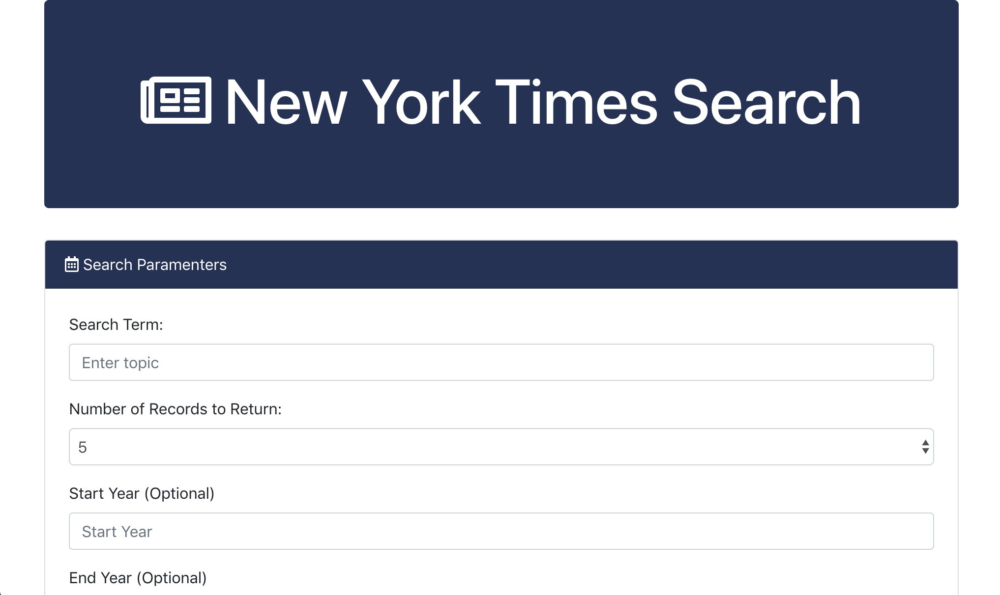

# NYT-Search

This application is used to search for terms and get response back with articles from the New York Times Website. Users can set the number of responses and the start/end date of the terms they are searching for.

# Images


Main Page for the Search


# Technologies Used
- HTML
- CSS
- Javascript
- JQuery
- Bootstrap

# Code Snippets
We make a ajax call to the API to get information back. Then we use the articles received from the API to display each one with a loop. Each article displayed will show the url, headline, and the author of the article. 
```
 $.ajax({
    url: queryURL,
    method: "GET"
}).then(function(result) {
    console.log(result);

    var resultsArray = result.response.docs;
    console.log(resultsArray);

    //appending articles
    for (i = 0; i < numArticles; i++){
        var tempJumbo =  $("<div class='jumbotron p-4 mx-3 mb-3'>");
        var tempA = $('<a href='+ resultsArray[0].web_url +'><h2><span class="badge badge-secondary darkBlue mr-2">'+(i+1)+'</span>' +resultsArray[i].headline.main+ '</h2></a>');
        var tempP =  $("<p>").text(resultsArray[i].byline.original);
        tempJumbo.append(tempA);
        tempJumbo.append(tempP);
        $(".articleContainer").append(tempJumbo);
    }
```
